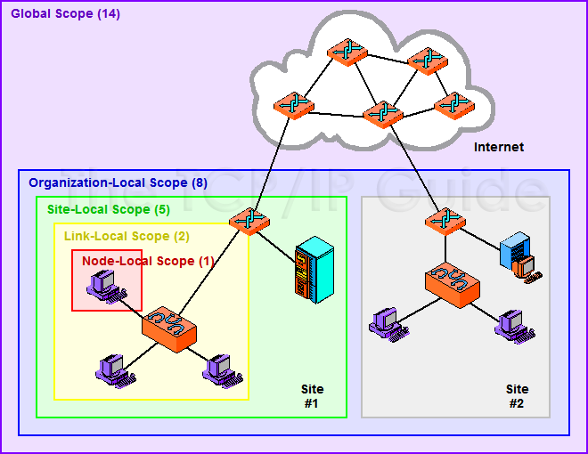
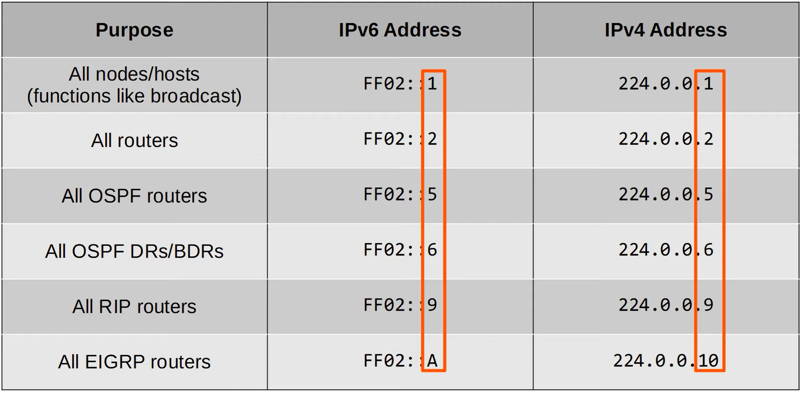

# IPv6
## What about IPv5?
- 'Internet Stream Protocol' was developed in the late 1970s, but it was never actually introduced for public use.
- It was never called 'IPv5', but it used a value of 5 in the version field of the IP header.
- So, when the successor to IPv4 was being developed, it was named IPv6

## Why IPv6?
- The main reason is that there simply aren't enough IPv4 address available.
- There are 2^32 (4,294,967,296) IPv4 addresses available.
- VLSM, private IPv4 addresses, and NAT have been used to conserve the use of IPv4 address space.
- IANA (Internet Assigned Numbers Authority) distributes IPv4 address space to various RIRs (Regional Internet Registries), which then assign them to companies that need them.

## Hexadecimal review
The following prefixes denote the type of numbering system
- binary : **0b** - 0, 1
- decimal: **0d** - 0, 1, 2, 3, 4, 5, 6, 7, 8, 9
- hexadecimal: **0x** - 0, 1, 2, 3, 4, 5, 6, 7, 8, 9, A, B, C, D, E, F

Note that each hexadecimal digit includes 4 bits of information, that is, hexadecimal 0 is 0000 in binary, and hexadecimal F is 1111 in binary.

## IPv6 Addressing
- An IPv6 address is 128 bits. Every additional bit doubles the number of possible addresses, and in IPv6 this amounts to about 3.4 x 10^38 possible addresses.
- The address is written in hexadecimal, for example... 2001:0DB8:0000:0000:0000:0000:C92D:09BD

### IPv6 Shorthand Notation
- To abbreviate ipv6 addresses, leading zeros can be removed as such... 2001:DB8:0:0:0:0:C92D:9BD
- Additionally, consecutive quartets of all 0s can be replaced with a double colon... 2001:0DB8:0000:0000:0000:0000:C92D:09BD, can be written as 2001:DB8::C92D:9BD
- consecutive quartets of 0s can only be abbreviated once in an IPv6 address.

### IPv6 Configuration
Typically, an enterprise requesting IPv6 addresses from their ISP will receive an /48 block.
- Typically, IPv6 subnets use a /64 prefix length. That means that an enterprise has 16 bits to use to make subnets.
    
    For example: 2001:0DB8:8B00:AAAA:0000:0000:0000:0000:0001/64
    - 2001:0DB8:8B00 is the 48-bit 'global routing prefix'
    - AAAA is the 16-bit 'subnet identifier
    - The remaining 0000:0000:0000:0000:0001 is the 64-bit host portion of the address.
    
    To find the IPv6 prefix, change all bits in the host portion of the address to 0. 
    - In the case above 2001:0DB8:8B00:AAAA::/64

### Modified EUI-64
The Modified EUI-64 (Extended Unique Identifier 64) is a method used to create IPv6 interface identifiers (host portions of IPv6 addresses) from the 48-bit Media Access Control (MAC) addresses used in Ethernet networks. It is primarily used for stateless address autoconfiguration in IPv6.

#### **The Modified EUI-64 Process:**

1. **MAC Address:**
   - The MAC address is a 48-bit (6-byte) identifier assigned to network interfaces for communication on a physical network. It is usually represented as 12 hexadecimal digits. 

2. **Insertion of FF:FE:**
   - The 48-bit MAC address is extended to 64 bits by inserting the hexadecimal value "FF:FE" in the middle of the MAC address. 

3. **Bit Manipulation:**
   - The seventh bit (the universal/local bit) in the MAC address is inverted. This means if it is 0, it becomes 1, and if it is 1, it becomes 0. 
   - MAC addresses can be divided into two types:
      - **UAA** (Universally Administered Address) Uniquely assigned to the device by the manufacturer
      - **LAA** (Locally Administered Address) Manually assigned by an admin, it doesn't have to be globally unique. 
   - You can idenitfy a UAA or LLA by the 7th bit of the MAC address, called the U/L bit (Universal/Local)
      - U/L set to **0 = UAA**, 
      - U/L set to **1 = LAA**.
   - In the context of IPv6 addresses / EUI-64, the meaning of the U/L bit is reversed: 
      - U/L bit set to **0** = The MAC address the EUI-64 int ID was made from was an LAA 
      - U/L bit set to **1** = The MAC address the EUI-64 int ID was made from was an UAA

4. **Creation of EUI-64:**
   - The result is the Modified EUI-64, a 64-bit interface identifier that can be combined with the network prefix to form a complete 128-bit IPv6 address.

#### **EUI-64 Examples**
For example, let's say we have a MAC address like `001A.2B3C.4D5E`. Applying the Modified EUI-64 process:

1. Insert FF:FE: `001A:2BFF:FE3C:4D5E`
2. Invert the seventh bit: `021A:2BFF:FE3C:4D5E`
3. Assuming '2001:db8::/64' is the network prefix, combine to complete the entire IPv6 address: `2001:DB8::021A:2BFF:FE3C:4D5E`

Alternatively, let's say we have a MAC address like `1234.5678.90AB.`

1. Insert FF:FE: `1234:56FF:FE78:90AB`
2. Invert the seventh bit: `1034:56FF:FE78:90AB`
3. Assuming '2001:db8::/64' is the network prefix, combine to complete the entire IPv6 address:  `2001:db8::1034:56FF:FE78:90AB`

#### **EUI-64 Summary**
The Modified EUI-64 method is commonly used for automatically generating host identifiers in Stateless Address Autoconfiguration (SLAAC) without the need for DHCPv6. It simplifies the configuration process by allowing hosts to create their interface identifiers based on the MAC address, maintaining a level of familiarity for network administrators accustomed to working with MAC addresses. However, it's important to note that privacy concerns have led to the development of alternative methods, such as IPv6 Stateless Address Autoconfiguration with Privacy Extensions (RFC 4941), to enhance the privacy of IPv6 addresses generated by hosts.

# IPv6 Address Types
IPv6 (Internet Protocol version 6) introduces several address types to accommodate the increased address space and to support various functionalities. 

These address types provide flexibility and support for various communication scenarios in the IPv6 protocol. Global unicast addresses are similar to public IPv4 addresses and are routable on the internet, while link-local addresses are used for communication within the same network segment. Multicast and Anycast addresses enable efficient and specialized communication patterns. Additionally, IPv6 introduces improved mechanisms for address configuration, such as Stateless Address Autoconfiguration (SLAAC) and DHCPv6.

Here are the main IPv6 address types:

## Unicast Addresses:
### Global Unicast Address:
 Similar to public IPv4 addresses, **global unicast addresses** are routable on the IPv6 internet. They are globally unique and used for communication between devices across the internet.
- Originally they were assigned from the range `2000::/3`, but now they are defined as all addresses which aren't reserved for other purposes. 
- They have to be registered for use.
- 2001:0DB8:8B00:AAAA:0000:0000:0000:0001/64 is sectioned as follows:
   - 2001:0DB8:8B00: --> 48bit 'global routing prefix' assigned by the ISP
   - AAAA: --> 16-bit 'subnet identifier' used by the enterprise to make various subnets
   - 0000:0000:0000:0001 --> 64-bit host portion of the address

### Link-Local Address:
Used for communication within the same network segment (link) or subnet. These addresses are automatically configured by devices when they are connected to a network. 
- They are assigned from the range `fe80::/10`
- The standard states that the 54 bits after FE80/10 should all be 0, so you won't see link local addresses beginning with FE9, FEA, FEB, Only FE8. 
- The Interface ID is generated using EUI-64 rules.
- Common uses of link-local addresses:
   - routing protocol peerings (OSPFv3) uses LLA for neighbor adjacencies
   - Next-hop addresses for static routes
   - Neighbor Discovery Protocol (NDP), IPv6's replacement for ARP, uses link-local addresses to function.

### Unique Local Address (ULA):
Similar to IPv4 private addresses, ULA addresses are used for private networks. They are not routable on the global internet and are designed for communication within an organization. 
- You don't need to register to use them.
- They don't need to be globally unique (Though best practice is to make them so). 
- They are assigned from the range `fc00::/7`, however a later update requires the 8th bit set to 1, so the first two digitst must be **fd**.
- As an example, FD45:93AC:8A8F:AAAA:0000:0000:0000:0001/64 is sectioned as follows:
   - FD --> Indicates a unique local address
   - 45:93AC:8A8F: --> 40-bit 'global ID', It should be randomly generated to prevent issues when companies merge
   - AAAA: --> 16-bit 'subnet identifier' used by the enterprise to make various subnets
   - 0000:0000:0000:0001 --> 64-bit host portion of the address

## Multicast Addresses:
- Multicast addresses are used to send traffic to multiple devices simultaneously.
- IPv6 uses range `ff00::/8` for multicast.
- IPv6 doesn't use broadcast, there is no 'broadcast address' in IPv6! But the Multicast address intended for end hosts serves the same basic function.

### Multicast Scopes
- IPv6 defines multiple multicast 'scopes' which indicate how far the packet should be forwarded. 

- **Interface-Local Multicast Scope:** The packet doesn't leave the local device. Can be used to send traffic to a service within the local device. They are assigned from the range `ff01::/16`

- **Link-Local Multicast Scope:** Used for communication within the same network segment. The packet remains in the local subnet. Routers will not route the packet between subnets. They are assigned from the range `ff02::/16`

The addresses in the image below use the 'link-local scope, for example.

- **Site-Local Multicast Scope:** The packet can be forwarded by routers. Should be limited to a single physical location (not forwarded over a WAN - Wide Area Network). They are assigned from the range `ff05:/16`

- **Organization-Local Multicast Scope:** Wider in scope than site-local (an entire company/organization). They are assigned from the range `ff08:/16`

- **Global Multicast:** Used for communication across the global internet. No boundaries, it is possible to be routed over the internet. They are assigned from the range `ff0e::/16`

## Anycast Addresses:
- Anycast is **'one-to-one-of-many**' routing. It is a new feature of IPv6.
- Anycast addresses are used for load balancing and high availability.
- Anycast addresses are assigned to multiple devices, and traffic is routed to the nearest (in terms of network topology / routing metric) device with that address.
- There is no specified address range for anycast addresses. Use a regular unicast address (global unicast, unique local) and specify it as an anycast address.

## Special Addresses:
- **Loopback Address (::1):** Similar to the IPv4 loopback address (127.0.0.1), the IPv6 loopback address is used for communication with the same device.

- **Unspecified Address (::):** Equivalent to the IPv4 address 0.0.0.0. 
   - The unspecified address is used as a placeholder when an IPv6 address is not yet assigned.
   - IPv6 default routes are configured to ::/0

- **IPv4-Compatible IPv6 Address:** Deprecated and no longer used.

- **IPv4-Mapped IPv6 Address:** Deprecated and no longer used.

