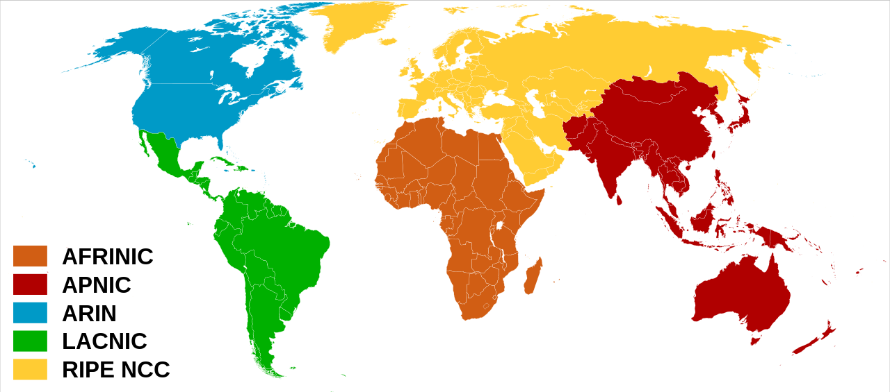

# What about IPv5?
- 'Internet Stream Protocol' was developed in the late 1970s, but it was never actually introduced for public use.
- It was never called 'IPv5', but it used a value of 5 in the version field of the IP header.
- So, when the successor to IPv4 was being developed, it was named IPv6

# Hexadecimal review
The following prefixes denote the type of numbering system
- binary : **0b** - 0, 1
- decimal: **0d** - 0, 1, 2, 3, 4, 5, 6, 7, 8, 9
- hexadecimal: **0x** - 0, 1, 2, 3, 4, 5, 6, 7, 8, 9, A, B, C, D, E, F

Note that each hexadecimal digit includes 4 bits of information, that is, hexadecimal 0 is 0000 in binary, and hexadecimal F is 1111 in binary.

# Why IPv6?
- The main reason is that there simply aren't enough IPv4 address available.
- There are 2^32 (4,294,967,296) IPv4 addresses available.
- VLSM, private IPv4 addresses, and NAT have been used to conserve the use of IPv4 address space.
- IANA (Internet Assigned Numbers Authority) distributes IPv4 address space to various RIRs (Regional Internet Registries), which then assign them to companies that need them.

# IPv6
- An IPv6 address is 128 bits. Every additional bit doubles the number of possible addresses, and in IPv6 this amounts to about 3.4 x 10^38 possible addresses.
- The address is written in hexadecimal, for example... 2001:0DB8:0000:0000:0000:0000:C92D:09BD
- To abbreviate ipv6 addresses, leading zeros can be removed as such... 2001:DB8:0:0:0:0:C92D:9BD
- Additionally, consecutive quartets of all 0s can be replaced with a double colon... 2001:0DB8:0000:0000:0000:0000:C92D:09BD, can be written as 2001:DB8::C92D:9BD
- consecutive quartets of 0s can only be abbreviated once in an IPv6 address.

Typically, an enterprise requesting IPv6 addresses from their ISP will receive an /48 block.
- Typically, IPv6 subnets use a /64 prefix length. That means that an enterprise has 16 bits to use to make subnets.
    
    For example: 2001:0DB8:8B00:AAAA:0000:0000:0000:0000:0001/64
    - 2001:0DB8:8B00 is the 48-bit 'global routing prefix'
    - AAAA is the 16-bit 'subnet identifier
    - The remaining 0000:0000:0000:0000:0001 is the 64-bit host portion of the address.
    
    To find the IPv6 prefix, change all bits in the host portion of the address to 0. 
    - In the case above 2001:0DB8:8B00:AAAA::/64

    