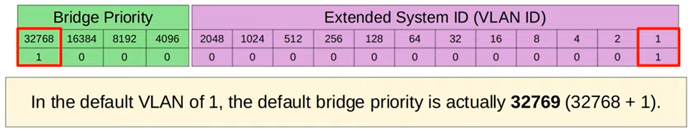
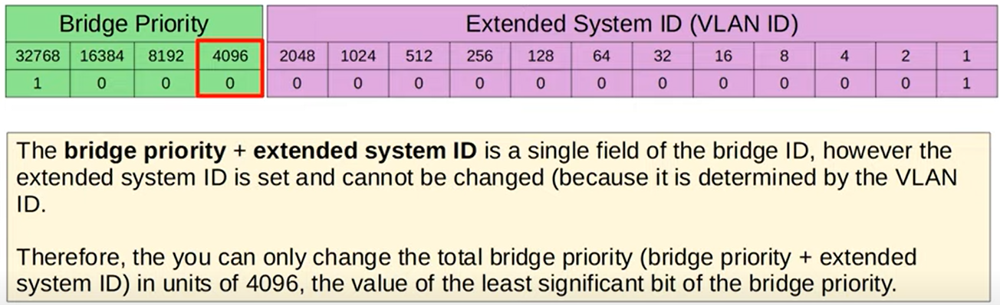

# Spanning Tree Protocol (STP)
The Spanning Tree Protocol (STP), aka "Classic Spanning Tree Protocol", is a network protocol used to prevent infinite loops in Ethernet networks, which can lead to broadcast storms and network instability. At the same time, STP is important to enable network redundancy in layer two devices. STP is part of the IEEE 802.1D standard and is designed to ensure that a single, loop-free path exists in a network, while blocking redundant paths.

Here are the key points about the Spanning Tree Protocol:

**1. Loop Prevention:**
   - Ethernet networks are susceptible to loops when multiple paths exist between switches. Loops can lead to broadcast storms, excessive traffic, and network downtime. STP's primary purpose is to detect and prevent these loops. STP prevents layer 2 loops by placing redundant ports in a blocking state, essentially disabling the interface. These interface act as backups that can enter a forwarding state if an active (=currently forwarding) interface fails. STP-enabled switches send/receive Hello BPDUs out of all interfaces, the default timer is 2 seconds. If a switch receives a Hello BPDU on an interface, it knows that interface is connected to another switch (routers, PCs, etc. do not use STP, so they do not send Hello BPDUs).

**2. Electing a Root Bridge:**
   - In an STP-enabled network, one switch is elected as the "Root Bridge." The Root Bridge serves as the reference point for all other switches in the network. It's responsible for calculating the optimal path to reach all other switches (designated as Bridge Ports) and, in turn, the end-user devices connected to those switches (designated as Port Access Devices).

**3. Bridge Protocol Data Units (BPDU):**
   - STP relies on Bridge Protocol Data Units (BPDUs) to exchange information among switches. BPDUs contain information about the sender's identity, priority, and the cost of the path to the Root Bridge. Interfaces in a forwarding state behave normally. They send and receive all normal traffic. However, interfaces in a blocking state only send or receive STP messages (called BPDUs = Bridge Protocol Units)

**4. Bridge ID:**
   - Each switch in the network has a unique Bridge ID, consisting of a priority value and a MAC address. The Bridge ID is used to determine the Root Bridge. 
   
   - Bridge ID is split into three fields, Bridge Priority, Extended System ID (=VLAN ID), and MAC Address. Extended System ID is used on cisco switches to use a version of STP called Per-VLAN Spanning Tree (PVST)
   
   - The Bridge Priority is compared first, and the switch with the lowest Bridge Priority becomes the root bridge. However, the default bridge priority is 32769 on all switches, so if that is not changed, the MAC address is used as the tie-breaker (lowest MAC address becomes the root bridge).
   
   
   - To change bridge priority without changing the VLAN, you must change the total bridge priority by the least significant bit of the bridge priority field, that is 4096. 
   

   - ALL ports on the root bridge are put in a forwarding state, and other switches in the topology must have a path to reach the root bridge. Forwarding ports on the root bridge have an STP cost of 0.

   - Each remaining switch will select ONE of its interfaces to be its root port. The interface with the lowest root cost will be the root port. Root ports are also in a forwarding state. port with 10 Mbps have an STP cost of 100, 100 Mbps have a cost of 19, 1 Gbps have a cost of 4, and 10 Gbps have a cost of 2.

   - If there is a tie in STP cost, Bridge ID is the tie breaker.
   - If there is a tie in Bridge ID because two physical connections exits between switches, the neighboring switches port ID is the tie breaker.
   - Every collision domain has a single STP designated port so for collision domains that are not tied to Root ports, the switch with the lowest Bridge ID will become the port in the forwarding state and the other will be in the non-designated (blocking) state.

**5. Path Cost:**
   - The cost of a path between two switches is calculated based on the link's bandwidth. Higher bandwidth links have lower costs. STP chooses the path with the lowest cumulative cost to reach the Root Bridge.

**6. Port States:**
   - STP switches have different port states, including:
     - **Blocking:** Ports in this state do not forward traffic but listen to BPDUs to detect loops.
     - **Listening:** Ports in this state prepare to forward traffic but still do not.
     - **Learning:** Ports in this state prepare to forward traffic while learning MAC addresses.
     - **Forwarding:** Ports in this state actively forward traffic.

**7. Convergence:**
   - STP is designed to converge quickly when the network topology changes. When a link failure occurs or a switch is added or removed, STP recalculates the topology to establish a new loop-free path.

**8. STP Variants:**
   - Several STP variants and enhancements have been developed over time, including Rapid Spanning Tree Protocol (RSTP) and Multiple Spanning Tree Protocol (MSTP). RSTP offers faster convergence, and MSTP allows for multiple STP instances to run on a single network.

**9. Cisco's PVST and PVST+:**
   - Cisco developed its own versions of STP, called Per-VLAN Spanning Tree (PVST) and Per-VLAN Spanning Tree Plus (PVST+). These versions extend STP to support VLAN-specific spanning trees, allowing for better load balancing and redundancy in networks with multiple VLANs.

STP is an essential protocol for network stability in Ethernet-based LANs. It ensures that network loops are avoided, and a single active path is established, preventing issues like broadcast storms and packet flooding. Network administrators should be familiar with STP and its variants to configure and manage networks effectively.

# Broadcast Storms

A broadcast storm is an abnormally high number of broadcast and multicast packets within a short period of time. Broadcast storms can occur when a device on a network sends a broadcast packet and all of the other devices on the network receive and forward the packet. This can cause a chain reaction, with each device forwarding the packet to all of the other devices on the network. This can quickly overwhelm the network and cause performance problems or even network outages.

There are a number of things that can cause broadcast storms, including:

**Misconfigured devices:** Devices that are misconfigured can send out too many broadcast packets, or they may forward broadcast packets that they should not forward.

**Network loops:** A network loop is a situation where a packet can travel around the same loop of devices indefinitely. This can cause broadcast packets to be forwarded repeatedly, which can lead to a broadcast storm.

**Malicious actors:** Malicious actors can launch denial-of-service attacks by sending out large numbers of broadcast packets. This can cause broadcast storms that can overwhelm the network and make it unusable for legitimate users.

Broadcast storms can have a number of negative consequences, including:

**Performance problems:** Broadcast storms can cause performance problems by consuming bandwidth and CPU resources. This can make it difficult for devices on the network to communicate with each other.

**Network outages:** In severe cases, broadcast storms can cause network outages by overwhelming the network and making it unusable.

**Security risks:** Broadcast storms can also increase the risk of security attacks, as attackers can use broadcast storms to spread malware or launch other types of attacks.
There are a number of things that can be done to prevent and mitigate broadcast storms, including:

**Configuring devices correctly:** Make sure that all devices on the network are configured correctly. This includes disabling unnecessary broadcast and multicast traffic.

**Eliminating network loops:** Make sure that there are no network loops on the network. This can be done using network monitoring tools or by manually checking the network configuration.

**Using broadcast storm prevention features:** Many routers and switches have features that can help to prevent and mitigate broadcast storms. These features can be used to limit the number of broadcast packets that are forwarded and to detect and isolate broadcast storms.

# Network Redundancy
Network redundancy is a design approach in networking that involves creating backup or redundant components, paths, or systems within a network to ensure continuous network availability, minimize downtime, and enhance fault tolerance. The goal of network redundancy is to maintain network connectivity and reliability even in the face of component failures, network congestion, or other unexpected issues. Here are some key aspects of network redundancy:

**1. Redundant Components:**
   - Network redundancy often involves duplicating critical components, such as switches, routers, servers, power supplies, and network cables. Redundant components are usually placed in such a way that if one fails, another can take over seamlessly.

**2. Redundant Paths:**
   - Redundant paths involve having multiple physical or logical connections between network devices. In case one path becomes unavailable due to link failure or congestion, traffic can be rerouted through an alternative path.

**3. Load Balancing:**
   - Redundancy can be combined with load balancing to distribute network traffic across multiple paths or components. Load balancers can monitor the health of network components and direct traffic to the most optimal path.

**4. High Availability:**
   - The primary goal of network redundancy is to ensure high availability. This means that network services and resources remain accessible to users and applications even when certain components or connections experience issues.

**5. Failover Mechanisms:**
   - Redundant systems often employ failover mechanisms that automatically switch to the backup component when a failure is detected. This can be achieved through technologies like Virtual IP addresses, Heartbeat monitoring, or protocols like HSRP (Hot Standby Router Protocol) and VRRP (Virtual Router Redundancy Protocol).

**6. Geographic Redundancy:**
   - Geographic redundancy involves replicating network infrastructure and data centers in different geographic locations. This approach provides protection against regional disasters or outages that could impact a single location.

**7. Redundant Power Supplies:**
   - Redundant power supplies in network devices ensure that the equipment remains operational even if one power supply fails. This is especially important in data centers and critical network infrastructure.

**8. Redundant Internet Connections:**
   - Organizations often have multiple internet connections from different providers to ensure internet access remains available, even if one provider experiences issues.

**9. Backup Data and Disaster Recovery:**
   - Network redundancy should be complemented by data redundancy and disaster recovery plans. Regularly backing up data and having a plan to recover from data loss or catastrophic events is crucial for overall network resilience.

**10. Complexity and Cost:**
    - Implementing network redundancy can be complex and may involve additional costs due to the purchase of redundant hardware and increased maintenance efforts. However, the benefits of improved reliability and availability often outweigh these costs.

Network redundancy is essential for ensuring business continuity, particularly in environments where network downtime can result in financial losses or significant disruptions. It is a critical component of designing robust and resilient network architectures.